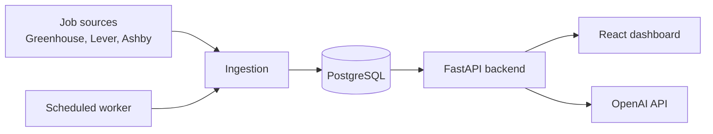

# Architecture (draft)

```mermaid
flowchart LR
    Sources[Job sources<br/>Greenhouse, Lever, Ashby] --> Ingestion
    Ingestion --> DB[(PostgreSQL)]
    DB --> API[FastAPI backend]
    API --> UI[React dashboard]
    Worker[Scheduled worker] --> Ingestion
    API --> LLM[OpenAI API]
```

This is the planned shape, not the current state. Only PostgreSQL exists today.